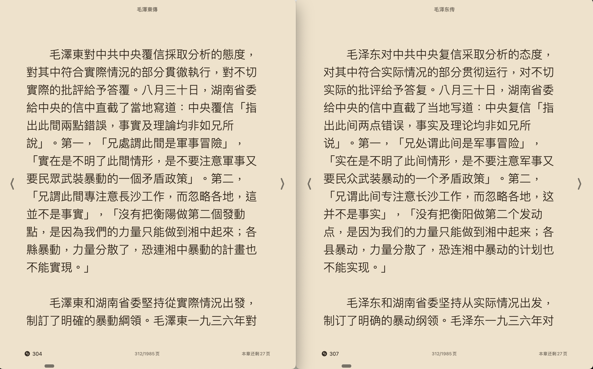

# EPUB Convert

把繁体中文 EPUB，一键转成简体中文 EPUB。

适合这几类场景：

- 你手里有一本繁体 EPUB，想直接得到简体版继续阅读
- 你想保留原书的目录、排版、图片、样式和字体
- 你想把这个能力接进 agent，当成一个可复用的 skill

这个仓库已经把两条路都准备好了：

- `app/`：一个可直接启动的 Web 服务，上传 EPUB 就能下载简体 EPUB
- `skill/`：一个可被 agent 调用的脚本型 skill

## 它能做什么

- 使用 OpenCC 把繁体中文转换成简体中文
- 默认使用 `tw2sp`，更适合常见繁体词汇到大陆简体表达
- 保留 EPUB 原有资源，包括图片、CSS、字体和文件结构
- 输出新的 `.simplified.epub` 文件，不是散乱的 txt
- 既能手动使用，也能被 agent 集成

## 效果图

把你的对比图放在这里：

```md

```

图片下方建议补一句说明：

> 左边是原始繁体 EPUB，右边是转换后的简体 EPUB，目录与版式保持不变。

## 为什么这个项目值得用

很多“繁转简”工具只能导出纯文本，或者会把 EPUB 的结构拆坏。这个项目的目标不是抽取文字，而是尽量保留一本电子书原本的阅读体验：

- 书还是 EPUB
- 目录还在
- 图片还在
- 样式还在
- 转完就能继续丢进阅读器里看

如果你面向中文世界的用户，这一点非常重要。大家想要的不是“翻译出一堆文本”，而是“拿回一本能继续读的简体书”。

## 两种用法

### 1. 当工具用

安装依赖：

```bash
python3 -m venv .venv
source .venv/bin/activate
pip install -r requirements.txt
```

直接转换本地 EPUB：

```bash
python3 skill/scripts/convert_epub.py /absolute/path/to/book.epub
```

默认会在同目录生成：

```bash
/absolute/path/to/book.simplified.epub
```

自定义输出路径：

```bash
python3 skill/scripts/convert_epub.py /absolute/path/to/book.epub --output /absolute/path/to/book-cn.epub
```

如果目标文件已存在，显式覆盖：

```bash
python3 skill/scripts/convert_epub.py /absolute/path/to/book.epub --force
```

### 2. 当服务用

启动 Web 服务：

```bash
python3 -m venv .venv
source .venv/bin/activate
pip install -r requirements.txt
uvicorn app.main:app --reload
```

启动后访问 [http://127.0.0.1:8000](http://127.0.0.1:8000)。

你会得到一个上传页面：

- 上传 `.epub`
- 点击转换
- 下载新的简体 EPUB

## 给 Agent 用

这个仓库已经包含完整 skill。对大多数 agent 场景来说，**最好的方式不是手工复制路径，而是直接把 GitHub 地址交给 agent**，让它自己：

- 拉取仓库
- 识别仓库里的 `skill/` 目录
- 安装或复制其中的 `SKILL.md`、`agents/openai.yaml`、`scripts/`
- 安装运行所需依赖

你可以直接这样告诉 agent：

```text
请使用这个 GitHub 仓库里的 skill：
https://github.com/linuo/epub-convert

skill 位于仓库根目录的 skill/ 下。
请把它安装到你的本地 skills 目录，并安装运行这个 skill 所需的依赖。
```

如果你的 agent 环境支持“从 GitHub 仓库安装 skill”或“根据仓库路径导入 skill”，这通常是最省心、也最适合分享给别人的方式。

### 手动安装

如果你所在的 agent 环境还不支持直接从 GitHub 导入 skill，也可以手动安装：

```bash
git clone https://github.com/linuo/epub-convert.git
cd epub-convert
python3 -m venv .venv
source .venv/bin/activate
pip install -r requirements.txt
mkdir -p "$HOME/.skills/epub-opencc-convert"
cp -R skill/. "$HOME/.skills/epub-opencc-convert/"
```

如果你的 agent 使用的是别的 skills 目录，把上面的 `$HOME/.skills/epub-opencc-convert` 改成对应路径即可。

安装完成后，agent 在遇到这些请求时就可以触发这个 skill：

- “把这本繁体 EPUB 转成简体 EPUB”
- “帮我把 zh-TW 的 epub 变成简体版”
- “用 OpenCC 处理这本电子书，输出新的 epub”

## 仓库结构

```text
.
├── app/
├── skill/
│   ├── SKILL.md
│   ├── agents/openai.yaml
│   └── scripts/convert_epub.py
├── requirements.txt
└── README.md
```

## 接口

Web 服务目前提供：

- `GET /`：上传页面
- `POST /convert`：上传 EPUB，返回转换后的 EPUB
- `GET /health`：健康检查

## 当前边界

这个项目现在专注于一件事：**把繁体中文 EPUB 稳定转成简体中文 EPUB**。

目前不包含：

- PDF 转 EPUB
- OCR
- 批量任务队列
- DRM 处理

## 一句话总结

如果你要的是“把一本繁体 EPUB 尽量原样地变成简体 EPUB”，这个仓库就是为这件事做的。
